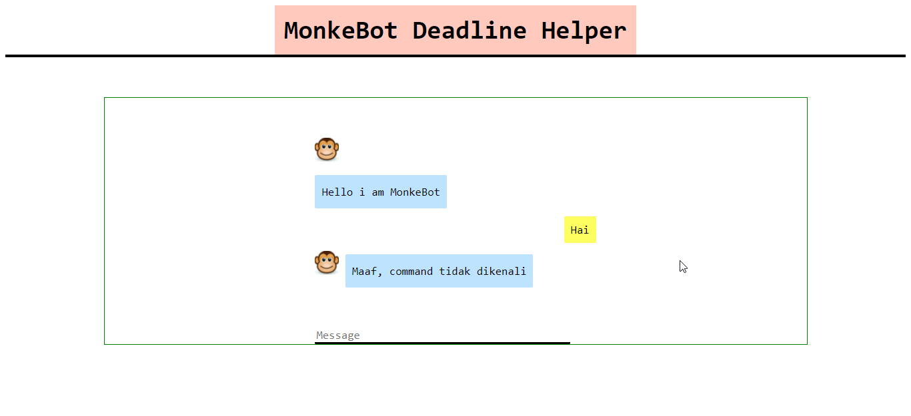

# MonkeBot
> MonkeBot adalah bot yang dapat mencatat deadline dari mahasiswa dengan mencari informasi yang diperlukan dari pesan yang dikirim pengguna. Bot juga dapat mengundur deadline dan menyelesaikan sebuah deadline

## Table of contents
* [General info](#general-info)
* [Screenshots](#screenshots)
* [Setup](#setup)
* [Features](#features)
* [Status](#status)
* [Identitas](#identitas)

## General info
Program ini dibuat untuk tugas besar ke-3 dari mata kuliah IF2211 Strategi Algoritma.

## Screenshots

## Setup
Program dijalankan dengan menjalankan app.py. Sebelumnya, perlu diinstall library Flask dengan 'pip install flask' pada terminal. Saat dijalankan, pengguna akan diminta untuk masuk ke suatu link pada terminal. Pada link itu, aplikasi akan berjalan.

## Code Examples
Show examples of usage:
`Add deadline kuis IF2240 pada 22/02/2020 dong abang bot`
`Deadlinenya susah, jadi dosen bilang deadline 1 diundur jadi 22 April 2021`
`Hari ini dosen bad mood jadi deadline 2 dimajuin jadi 24/12/1999 :(`
`Asik! Deadline 1 udah selesai`
`<add pesan buat nampilin deadline disini>`
`help pls`

## Features
List of features ready and TODOs for future development
* Menambah deadline
* Mengubah deadline
* Menampilkan deadline
* Menyelesaikan deadline

## Status
Project is: _finished_

## Identitas
JOEL TRIWIRA / 13519073  
HIZKIA RADITYA PRATAMA ROOSADI / 13519087  
ANDRIANATA PUTRA TJANDRA / 13519059